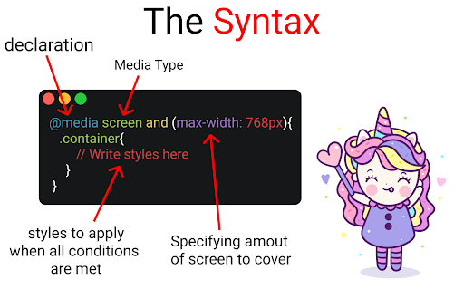
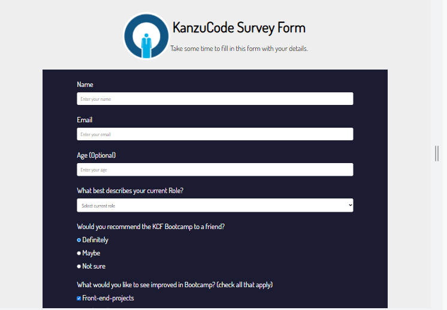
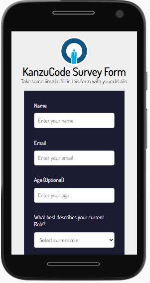

# Responsive Web Design
In this tutorial, we shall be looking at what responsive web design is and transforming a sample site to make it more responsive using CSS media queries. This tutorial is aimed at giving you just the basics that you need to get started using media queries and hence readers are adviced to read some additional resources incase they require a dive deep into this topic. Links to some additional resources are linked at the end of this tutorial.

You can find the code to the sample project [here](https://github.com/kal-J/kanzu-code-survey-form)

Responsive web design (RWD) or responsive design is an approach to web design that aims to make web pages render well on a variety of devices and window or screen sizes. It involves a set of practices that allows web pages to alter their layout and appearance to suit different screen widths and resolutions.

## Techniques to achieve responsive designs
1. The viewport meta tag.
2. Modern layout technologies (Flexbox & CSS Grids)
3. Media Queries

The viewport meta tag is used to control viewport's size and scale.
```
<meta name="viewport" content="width=device-width, initial-scale=1.0" />
```
 If you want an in-depth look into what it is, here is a [resource](https://developer.mozilla.org/en-US/docs/Web/HTML/Viewport_meta_tag) , knock yourself out.

Modern layout technologies such as flexbox & CSS grids are also used when designing responsive sites.

Media query is a CSS technique introduced in CSS3. It uses the @media rule to include a block of CSS properties only if a certain condition is true.
```
@media media type and (condition: breakpoint) {
    //css rules
}
```



<br>

Below is a mobile vs desktop view of our sample site before applying our media query.

`Mobile`


`Desktop`



`index.html`
```
<!DOCTYPE html>
<html lang="en">
    <head>
        <meta charset="UTF-8">
        <link rel="stylesheet" href="style.css">
        <title>CodeImpact-SurveyForm</title>
    </head>
    <body>
        <header>
            
            <div>
                <h1 id="title">KanzuCode Survey Form</h1>
                <p id="description">Take some time to fill in this form with your details.</p>
            </div>
        </header>
        
        <form id="survey-form">
            <div class="form-group">
                <label for="name" id="name-label">Name</label>
                <input type="text" id="name" placeholder="Enter your name" required>
            </div>
            
            <div class="form-group">
                <label for="email" id="email-label">Email</label>
                <input type="email" id="email" placeholder="Enter your email" required>
            </div>

            <div class="form-group">
                <label for="number" id="number-label">Age (Optional)</label>
                <input type="number" id="number" placeholder="Enter your age" min="9" max="25">
            </div>

            <div class="form-group">
                <p>What best describes your current Role?</p>
                <select name="role" id="dropdown">
                   <option disabled selected value="">Select current role</option>
                   <option value="student">Student</option>
                   <option value="learner">Full time learner</option>
                   <option value="job">Employed</option>
                   <option value="other">Other</option>
                </select>
            </div>

            <div class="form-group" id="radio-buttons">
                <p>Would you recommend the KCF Bootcamp to a friend?</p>
                <label>
                   <input type="radio" name="recommend" value="Definitely" checked>
                   Definitely
                </label>
                <label>
                   <input type="radio" name="recommend" value="Maybe">
                   Maybe
                </label>
                <label>
                   <input type="radio" name="recommend" value="Not Sure">
                   Not sure
                </label>
            </div>

            <div class="form-group" id="checkboxes">
                <p>What would you like to see improved in Bootcamp? <span>(check all that apply)</span></p>
                <label>
                   <input type="checkbox" checked value="front-end-projects">
                   Front-end-projects
                </label>
                <label>
                    <input type="checkbox" value="back-end-projects">
                    Back-end-projects
                </label>
                <label>
                    <input type="checkbox" value="data-visualization">
                    Data-visualization
                </label>
                <label>
                    <input type="checkbox" value="Pair-programming">
                    Pair-programming sessions
                </label>
                <label>
                    <input type="checkbox" value="Challenges">
                    Coding Challenges
                </label>
            </div>

            <div class="form-group">
                <p>Any comments or suggestions?</p>
                <textarea name="comment" id="comment"  placeholder="Enter your comment"></textarea>
            </div>

            <div class="form-group">
                <button type="submit" id="submit">Submit</button>
            </div>

        </form>
        
    </body>
</html>
```
`style.css`
```
@import url('https://fonts.googleapis.com/css2?family=Dosis&display=swap');
* {
	margin: 0;
	padding: 0;
	box-sizing: border-box;
	font-family: 'Dosis', sans-serif;
}
body {
	background-color: #eee;
	font-weight: 400;
	font-size: 1.5rem;	
}

header {
	text-align: center;
	padding-top: 3rem;
	margin-bottom: 2rem;
	line-height: 2;
	display: flex;
	justify-content: center;
}

header img{
	width:10rem;
	height: 10rem;
	border-radius: 50%;
}

#survey-form {
	background-color: #1b1b32;
	color: white;
	width: 80%;
    margin: auto;
    padding-bottom: 3rem;
}

.form-group {
	width: 80%;
	margin: auto;
	padding-top: 2rem;
	display: flex;
	flex-direction: column;
}

input {
	outline: none;
}

#name,
#email,
#number,
#dropdown {
	margin-top: 0.8rem;
	border: none;
	padding: 0.7rem;
	font-weight: 500;
    font-size: 1rem;
    border-radius: 0.3rem;
}

#radio-buttons > label, #checkboxes > label{
    padding-top:0.8rem;
}

#comment{
    margin-top:0.8rem;
    margin-bottom:0.8rem;
    padding:0.7rem;
    height:5rem;
    font-size: 1.2rem;
    outline: none;
    border: none;
    border-radius: 0.3rem;
}

#submit{
    padding:0.7rem;
    font-size: 1rem;
    color: white;
    background-color: #37af65;
    border-radius: 0.3rem;
    outline: none;
    border: none;
    cursor: pointer;
}

```
Comparing the mobile and the desktop version of the site, you can see how our site appears well on the desktop but is totally distorted and un-usuable on the mobile version. To fix that, lets add the code below to the bottom of our `style.css`

`style.css`
```
@media (max-width: 425px) {
  /*Small smartphones */

  body {
    background-color: #eee;
    font-weight: 200;
    font-size: 1rem;
  }

  header {
    padding-top: 1rem;
    margin-bottom: 1rem;
    line-height: 1.2;
    flex-direction: column;
  }

  header img {
    width: 5rem;
    height: 5rem;
    border-radius: 50%;
    margin: auto;
  }

  header div {
    padding: 0 0.7rem;
  }

  #survey-form {
    padding-bottom: 5rem;
  }
}
```
Here is a breakdown of what we just did, we added a media query rule which evalutes to true each time the width of the screen is atleast `425px` . Once that is the case, the css inside the `{}` of the media query is applied to the dom.
```
@media (max-width: 425px) {
    // css rules applied
}
```
If the screen width is above `425px` , the css rules inside the `{}` of the media query are not applied to the dom.

With that, each time the users access our site from a mobile device whose width is `425px` and below, they get to interact with the version of the design customizable for such small screens whereas any users accessing from screens above `425px` get to interact with a design suited for larger screens.
Below is how our mobile version would look after adding the media query.

`Responsive mobile version`



That's much bettter right?.. right?

Thats a quick walk through on how you can go about putting together a responsive site.

[Here](https://css-tricks.com/a-complete-guide-to-css-media-queries/) is an additional resource you can refer to regarding css media queries.